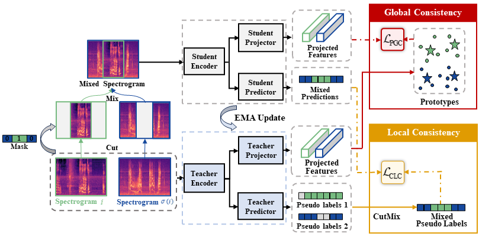

# LGC-SED

The official implementations of "Semi-supervised Sound Event Detection with Local and Global Consistency Regularization" (accepted by ICASSP 2024). 

[](https://opensource.org/licenses/MIT)


## Introduction

LGC pursues the local consistency regularization and global consistency regularization simultaneously. The former adopts audio CutMix to change the boundaries of a sound event and helps to learn robust patterns under varying contexts, while the later leverages a contrastive loss to encourage frame features to be appealed to according class prototypes and repelled to prototypes of other classes. Therefore, the intra-class variance is decreased while the intra-class variance is increased for learning a decision boundary at low-density regions. 

Here is an overview of our method,




## Get started

We provide the source code for vanilla LGC which is not combined with audio augmentations or other consistency regularization methods (e.g., SCT, RCT). Besides, LGC is lightweight and can be reproduced on a single RTX 3080 with 10 GB RAM. Here are the instructions to run it,

1. Download the whole DESED dataset (please notice that we do not use the strong real subset which contains 3470 audio clips).
2. Build up the environment. The environment of this code is the same as the DCASE 2022 baseline (so the PSDS score we used for evaluation is the threshold dependent one).
3. Clone the codes by:

```
git clone https://github.com/Ming-er/LGC-SED.git
```

4. Change all required paths in `src/confs/default.yaml`  to your own paths. 

5. Then you can start training by,

```
python train_sed.py
```


## Citation

If you want to cite this paper:

```
@article{li2023semi,
  title={Semi-supervised Sound Event Detection with Local and Global Consistency Regularization},
  author={Li, Yiming and Wang, Xiangdong and Liu, Hong and Tao, Rui and Yan, Long and Ouchi, Kazushige},
  journal={arXiv preprint arXiv:2309.08355},
  year={2023}
}
```